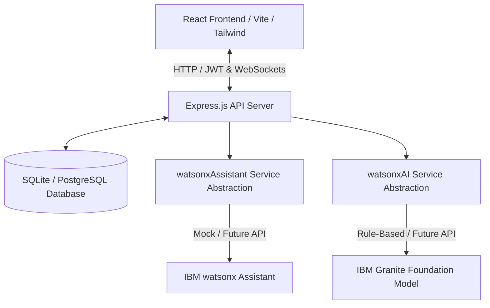
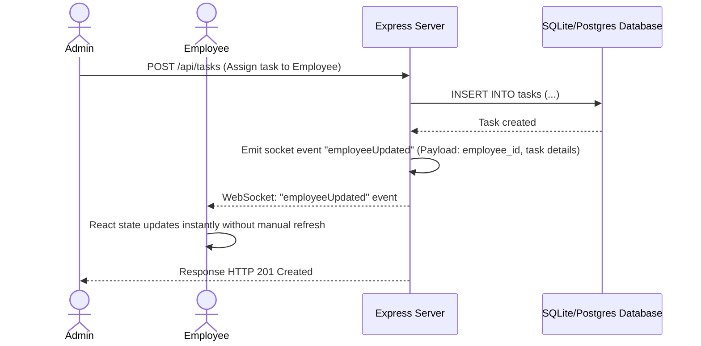

# IBM OnboardAI - Architecture Plan

This document details the system architecture, component layout, communication flows, and design principles for the IBM OnboardAI Onboarding platform.

---

## 1. High-Level System Architecture

IBM OnboardAI is structured as an enterprise-grade full-stack web application with client, server, and shared directories.

---

## 2. Component Layout & Responsibilities

### A. Frontend (client/)
Built as a Single Page Application (SPA) using React and Vite, structured for high responsiveness, visual excellence, and fluid transitions.
- **State & Routing**: Managed with standard React state, hooks, context API, and `react-router-dom` for client-side routing.
- **Styling & UI**: Tailwind CSS for component styling matching the IBM Carbon design system (IBM Blue, modern grids, clean borders).
- **Animations**: Framer Motion for premium micro-interactions, page-level transitions, card entries, sidebar drawers, modal popups, and real-time chat bubbles.
- **Client Communication**: Axios for HTTP/REST endpoints and `socket.io-client` for real-time push notifications and state updates.

### B. Backend (server/)
A lightweight, high-performance Node.js service running Express.
- **API Routing**: REST endpoints for authentication, document uploading, task manipulation, access requests, and chat interactions.
- **Authentication**: Stateless JWT-based authentication. Passwords hashed using bcrypt.
- **Real-Time Engine**: Socket.IO integration to broadcast real-time state changes (such as task assignment, document verification, access request approvals) to active clients.
- **Services (AI Integration)**:
  - `server/services/watsonxAssistant.js`: Handles chat agent functionality (initially mocked, later using IBM watsonx Assistant).
  - `server/services/watsonxAI.js`: Generates onboarding action recommendations (initially rule-based, later using IBM Granite Model).
  - Abstraction barrier guarantees that the frontend is completely decoupled from the AI backend implementations.

### C. Shared Constants (shared/)
Contains common types, validation rules, error codes, and global configuration values used by both client and server to prevent duplication and enforce schema consistency.

---

## 3. Communication & Real-Time Flow

For actions that require real-time feedback (such as an Admin assigning a checklist item or updating an access request):

---

## 4. Watsonx Abstraction Services

The architecture isolates the AI calls behind service files to simplify testing, rapid iteration, and eventual deployment of production AI models.

### `watsonxAssistant.js`
- **Interface**: `async function sendMessage(employeeId, messageHistory, currentMessage)`
- **Behavior Phase 1**: Returns context-aware mock strings (e.g., answering onboarding questions about company benefits, IT setup, first-day schedules).
- **Behavior Phase 2**: Executes requests against the IBM watsonx Assistant API using the official SDK.

### `watsonxAI.js`
- **Interface**: `async function generateRecommendations(employeeDetails)`
- **Behavior Phase 1**: Inspects `department`, `os_type`, and `onboarding_stage` to produce rule-based task, learning, and buddy recommendations.
- **Behavior Phase 2**: Formulates prompts and queries the Granite Foundation Model via Watsonx AI to generate personalized recommendations.

---

## 5. Security & Access Control

Security is baked into the foundation to protect sensitive employee records and onboarding documents:
1. **JWT Verification**: Secured routes inspect incoming `Authorization: Bearer <token>` headers.
2. **Role Authorization**: Middelewares ensure employees cannot access administrator tables and endpoints (`/api/admin/*`).
3. **Password Security**: Safe storage using salted bcrypt hashing.
4. **File Safety**: Uploaded onboarding documents undergo file type verification (e.g., pdf, png, jpg) and size limits. File paths are masked; they are not served directly.
5. **Notice Display**: UI will clearly display secure indicators like: *"Documents are securely stored and accessible only to authorized users."*
