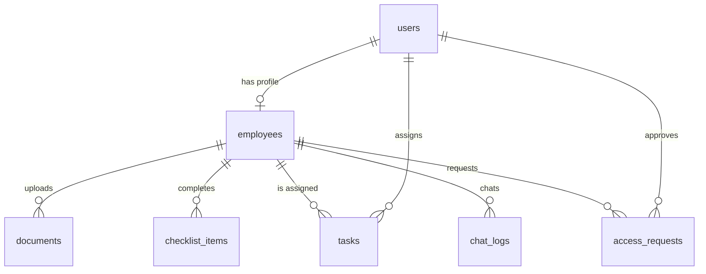

# IBM OnboardAI - Database Plan

This document details the database schema, indexes, integrity rules, and migrations designed for compatibility with both SQLite (local development fallback) and PostgreSQL (production).

---

## 1. Database Schema Specifications

### A. Table: `users`
Stores user credentials and roles. Both employees and administrators are in this table.
- **Fields**:
  - `id`: `INTEGER` (SQLite Auto-increment) / `SERIAL` (PostgreSQL Primary Key)
  - `name`: `VARCHAR(100)` (Not Null)
  - `email`: `VARCHAR(255)` (Unique, Not Null)
  - `password_hash`: `VARCHAR(255)` (Not Null)
  - `role`: `VARCHAR(20)` (Not Null) - Enforced values: `'employee'`, `'admin'`
  - `created_at`: `TIMESTAMP` (Default CURRENT_TIMESTAMP)

---

### B. Table: `employees`
Contains profile details and onboarding progress metrics for users with the `'employee'` role.
- **Fields**:
  - `id`: `INTEGER` / `SERIAL` (Primary Key)
  - `user_id`: `INTEGER` (Not Null, Foreign Key referencing `users(id)` ON DELETE CASCADE)
  - `department`: `VARCHAR(100)`
  - `designation`: `VARCHAR(100)`
  - `manager`: `VARCHAR(100)` (Name or Email of manager)
  - `buddy`: `VARCHAR(100)` (Name or Email of onboarding buddy)
  - `joining_date`: `DATE`
  - `onboarding_stage`: `VARCHAR(50)` (e.g., `'pre-joining'`, `'first-day'`, `'first-week'`, `'completed'`)
  - `offer_accepted`: `BOOLEAN` (Default `FALSE`)
  - `os_type`: `VARCHAR(20)` (e.g., `'mac'`, `'windows'`)
  - `status`: `VARCHAR(20)` (Default `'active'`)

---

### C. Table: `documents`
Tracks onboarding compliance documents uploaded by employees.
- **Fields**:
  - `id`: `INTEGER` / `SERIAL` (Primary Key)
  - `employee_id`: `INTEGER` (Not Null, Foreign Key referencing `employees(id)` ON DELETE CASCADE)
  - `document_name`: `VARCHAR(255)` (Not Null)
  - `document_type`: `VARCHAR(100)` (e.g., `'offer_letter'`, `'tax_form'`, `'identity_proof'`)
  - `file_path`: `VARCHAR(512)` (Not Null - path to stored local file or S3 URI)
  - `verification_status`: `VARCHAR(20)` (Default `'pending'` - values: `'pending'`, `'verified'`, `'rejected'`)
  - `created_at`: `TIMESTAMP` (Default CURRENT_TIMESTAMP)

---

### D. Table: `checklist_items`
Personalized onboarding checklists generated for employees.
- **Fields**:
  - `id`: `INTEGER` / `SERIAL` (Primary Key)
  - `employee_id`: `INTEGER` (Not Null, Foreign Key referencing `employees(id)` ON DELETE CASCADE)
  - `title`: `VARCHAR(255)` (Not Null)
  - `description`: `TEXT`
  - `priority`: `VARCHAR(20)` (Default `'medium'` - values: `'low'`, `'medium'`, `'high'`)
  - `completed`: `BOOLEAN` (Default `FALSE`)
  - `completed_at`: `TIMESTAMP` (Nullable)

---

### E. Table: `tasks`
Ad-hoc tasks assigned to employees by managers or HR admins.
- **Fields**:
  - `id`: `INTEGER` / `SERIAL` (Primary Key)
  - `employee_id`: `INTEGER` (Not Null, Foreign Key referencing `employees(id)` ON DELETE CASCADE)
  - `title`: `VARCHAR(255)` (Not Null)
  - `description`: `TEXT`
  - `assigned_by`: `INTEGER` (Not Null, Foreign Key referencing `users(id)`)
  - `status`: `VARCHAR(20)` (Default `'pending'` - values: `'pending'`, `'in_progress'`, `'completed'`)
  - `deadline`: `TIMESTAMP` (Nullable)

---

### F. Table: `access_requests`
Requests for enterprise tools, systems, or software licenses.
- **Fields**:
  - `id`: `INTEGER` / `SERIAL` (Primary Key)
  - `employee_id`: `INTEGER` (Not Null, Foreign Key referencing `employees(id)` ON DELETE CASCADE)
  - `application_name`: `VARCHAR(100)` (Not Null)
  - `reason`: `TEXT`
  - `status`: `VARCHAR(20)` (Default `'pending'` - values: `'pending'`, `'approved'`, `'rejected'`)
  - `approved_by`: `INTEGER` (Nullable, Foreign Key referencing `users(id)`)

---

### G. Table: `chat_logs`
Logs conversation history with the Watsonx AI onboarding assistant.
- **Fields**:
  - `id`: `INTEGER` / `SERIAL` (Primary Key)
  - `employee_id`: `INTEGER` (Not Null, Foreign Key referencing `employees(id)` ON DELETE CASCADE)
  - `sender`: `VARCHAR(20)` (Not Null - values: `'user'`, `'ai'`)
  - `message`: `TEXT` (Not Null)
  - `timestamp`: `TIMESTAMP` (Default CURRENT_TIMESTAMP)

---

## 2. Relationships & Entity-Relationship Diagram

---

## 3. Performance Indexes

To support rapid lookups and join queries for real-time dashboards:
- `CREATE UNIQUE INDEX idx_users_email ON users(email);`
- `CREATE INDEX idx_employees_user_id ON employees(user_id);`
- `CREATE INDEX idx_documents_employee_id ON documents(employee_id);`
- `CREATE INDEX idx_checklist_employee ON checklist_items(employee_id);`
- `CREATE INDEX idx_tasks_employee ON tasks(employee_id);`
- `CREATE INDEX idx_access_employee ON access_requests(employee_id);`
- `CREATE INDEX idx_chat_logs_employee ON chat_logs(employee_id);`
